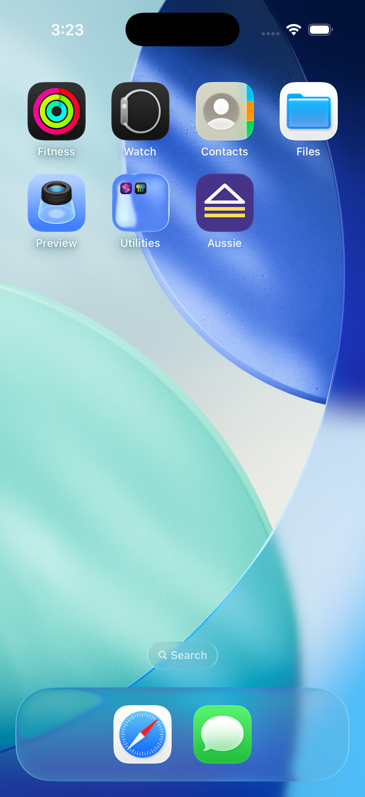
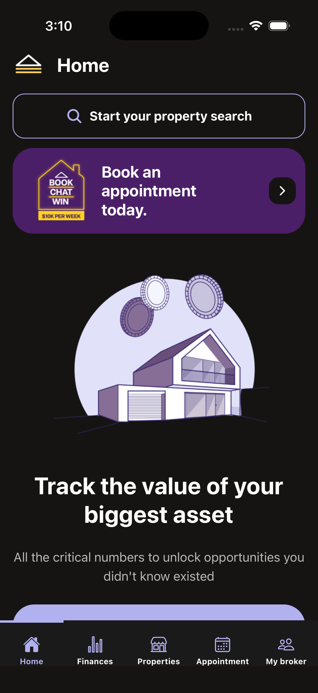
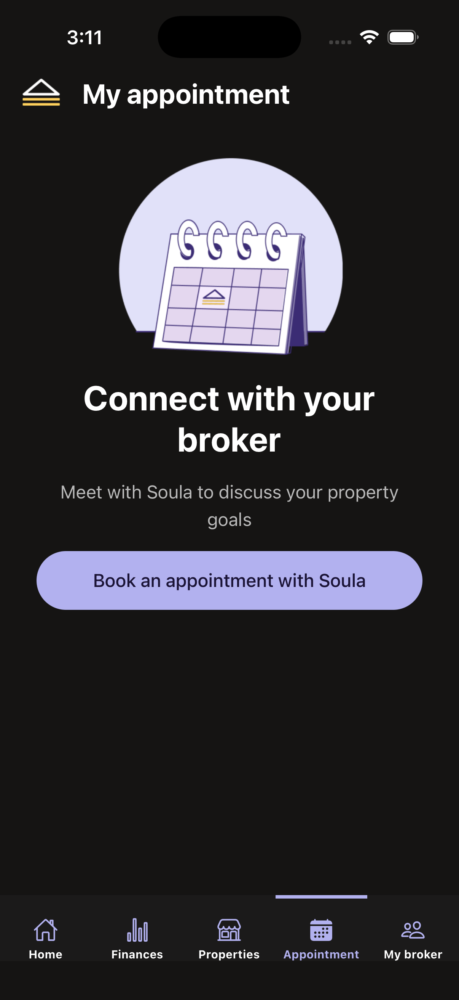
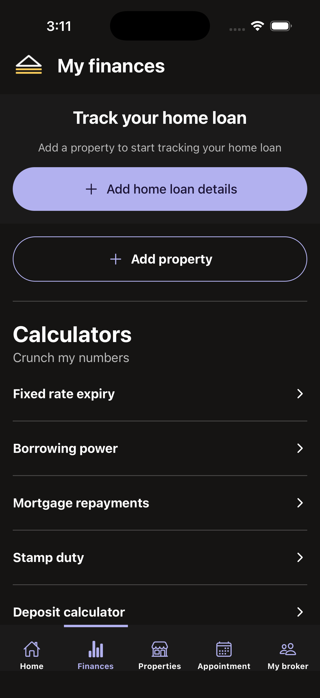
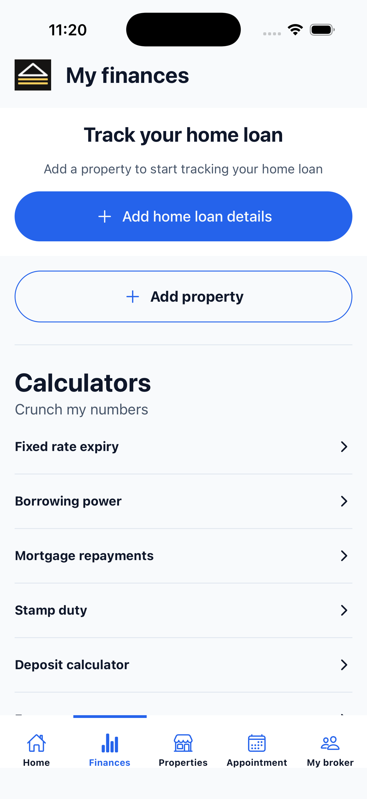
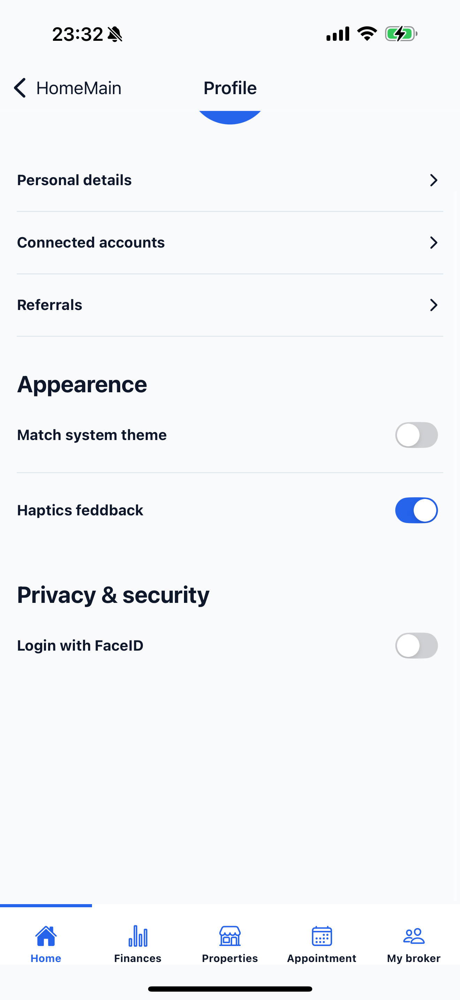
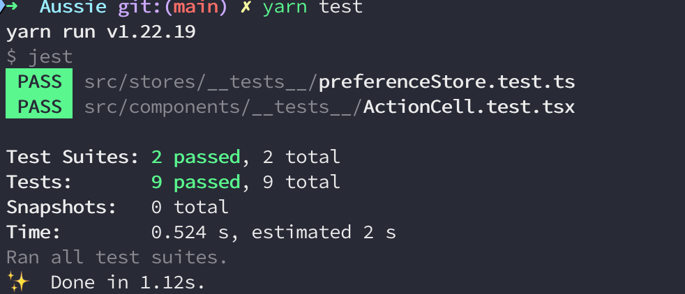

# Aussie React Native Demo

Demo mobile app scaffold for Aussie, built with **React Native v0.80.0**. It showcases navigation, theming, global state management, persisted storage, testing, and CI wiring that you can expand into a production-ready app.

## Screens

| App                              | Home                                      | Appointment                                             |
| -------------------------------- | ----------------------------------------- | ------------------------------------------------------- |
|  |  |  |

| Finances - Dark                                        | Finance - Light                                                   | Profile - Light                                             |
| ------------------------------------------------------ | ----------------------------------------------------------------- | ----------------------------------------------------------- |
|  |  |  |

## Highlights

- **Navigation:** React Navigation configured with the original five bottom tabs plus shared header components.
- **Design System:** Centralized theme with light/dark palettes, spacing/typography tokens, and a `makeStyles` helper to build component styles from the theme.
- **Global State:** Zustand-powered root store with a composable preference slice for FaceID, haptics, and theme selection.
- **Local Persistence:** `react-native-mmkv-storage` caches preference data through a JSON-backed storage adapter.
- **Authentication:** Auth0 integration with OpenID Connect (OIDC) service, enabling secure login with Auth0 and automatic biometric authentication when FaceID is enabled. Token management uses iOS Keychain and Android Keystore via `react-native-keychain` for secure credential storage, with automatic token refresh and session management.
- **Screens:** Draft UI implementations for Home, Finances, MyBroker (profile), Properties, and Appointment flows.
- **Testing:** Jest + React Native Testing Library configured for colocated component tests and store tests (with MMKV + icon mocks).
- **E2E Testing:** Detox integrated for end-to-end testing with comprehensive test coverage for all 5 tabs and 6 screens.
- **Deep Linking:** Schema URL support (`aussie://`) with React Navigation linking configuration for seamless navigation to specific screens.
- **Animations:** `react-native-reanimated` implemented for smooth button interactions with scale and opacity animations matching the original app design.
- **Tooling:** ESLint, Prettier, and Husky-friendly npm scripts, plus a simple CI workflow that lints, formats, and tests on every push/PR.

### Authorisation

The authentication flow integrates Auth0 with OpenID Connect, secure token storage in Keychain, and biometric auto-login:


**Key Components:**
- **Auth0 Service**: Handles OIDC authentication, token refresh, and user info retrieval
- **Keychain Storage**: Securely stores access tokens, ID tokens, and refresh tokens using `react-native-keychain`
- **Biometric Service**: Manages FaceID/TouchID authentication for seamless auto-login
- **Auth Store**: Zustand store managing authentication state, user data, and token lifecycle


### Detox testing

https://github.com/user-attachments/assets/9bae7715-8d3a-456c-a07a-30379eeef251

### Deeplink

https://github.com/user-attachments/assets/50281c92-98a9-46b8-a437-d4ec33cf8b76

### Animated button

https://github.com/user-attachments/assets/4f486684-444d-47dc-89a6-6fde561a81f3

## Project Structure

```
$ tree -L 2 src
src
├── api
├── assets
│   └── images
├── components
│   ├── ActionCell.tsx
│   ├── Button.tsx
│   ├── Container.tsx
│   ├── Logo.tsx
│   ├── Spacing.tsx
│   ├── SwitchCell.tsx
│   ├── Text.tsx
│   ├── __tests__
│   └── index.tsx
├── config
│   └── auth0.ts
├── hooks
│   └── preferenceHooks.ts
├── navigation
│   ├── AuthNavigator.tsx
│   ├── NavigationHeader.tsx
│   ├── TabBar.tsx
│   ├── index.tsx
│   └── types.ts
├── screens
│   ├── Appointment
│   ├── Auth
│   ├── Finances
│   ├── Home
│   ├── MyBroker
│   └── Properties
├── services
│   ├── authService.ts
│   ├── biometricService.ts
│   └── deeplink.ts
├── stores
│   ├── __tests__
│   ├── authStore.ts
│   ├── index.ts
│   ├── preferenceStore.ts
│   └── stateStorage.ts
├── theme
│   ├── ThemeContext.tsx
│   ├── colors.ts
│   ├── index.tsx
│   ├── spacings.ts
│   ├── theme.ts
│   ├── typography.ts
│   └── useStyle.ts
├── types
│   ├── auth.ts
│   └── env.d.ts
└── utils
    └── localStorage.ts
```

## Running Tests

### Unit Tests

Run `yarn test`

|                                                |
| ---------------------------------------------- |
|  |

### E2E Tests

Run Detox end-to-end tests on iOS:

```bash
yarn run detox:test:ios
```

E2E tests cover:

- App launch and basic UI verification
- Tab navigation across all 5 tabs
- Screen content and interactions for all 6 screens
- Navigation flows including nested screens (e.g., Home → Profile)
